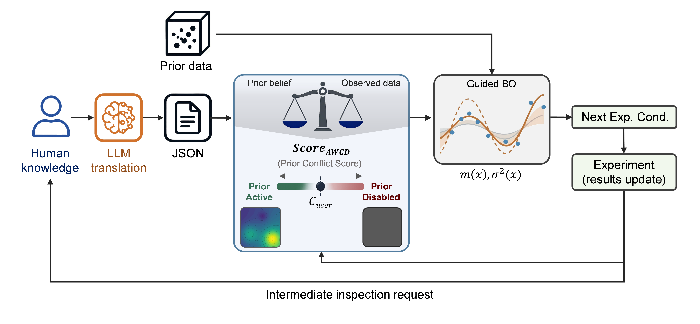

# Prior-Shaped Bayesian Optimization

This repository studies Bayesian optimization with structured prior knowledge. The main idea is to compare standard BO against a prior-shaped variant that injects expert knowledge or data-derived readouts into the surrogate model, while using a safety mechanism to disable misleading priors when needed.



The two main benchmark files are:

- `main_benchmark_portion_new_safety.py`: UGI reaction benchmark on a continuous domain.
- `main_benchmark_portion_new_safety_p3ht.py`: P3HT conductivity benchmark on a finite lookup table.

For interactive use, the recommended interface is:

- `hilo_gui.py`: Streamlit GUI for the UGI benchmark with manual JSON priors, chat-assisted readout editing, and AWCD safety monitoring.

## What This Project Contains

### Main UGI workflow

- `main_benchmark_portion_new_safety.py`
  The main UGI benchmark and figure-generation script. It contains the core implementations for:
  - random search
  - baseline BO with GP + Expected Improvement
  - prior-shaped BO
  - guarded prior-shaped BO with AWCD-based prior shutdown
  - data-fraction benchmarks
  - initialization-budget benchmarks
  - threshold sweeps and readout visualization

- `data_analysis.py`
  Loads and merges the UGI data, builds a Random Forest oracle, and provides analysis utilities.

- `prior_gp.py`
  Defines the prior mean, residual GP fitting, alignment utilities, and the hybrid GP model used by the UGI benchmark and GUI.

- `readout_schema.py`
  Defines the readout JSON schema helpers and converts raw-domain readouts into normalized priors.

- `data_to_prior.py`
  Builds a readout from a fraction of historical data using an LLM through `llm_study.py`.

- `llm_study.py`
  Central registry for OpenAI, Anthropic, and OpenAI-compatible local models used for data-derived prior generation.

### Interactive interface

- `hilo_gui.py`
  Streamlit dashboard for the UGI problem. This is the cleanest runnable interface in the repository.

- `hilo_readout_current.json`
  The latest GUI readout.

- `hilo_readout_history.jsonl`
  Append-only history of readout edits from the GUI.

### P3HT workflow

- `main_benchmark_portion_new_safety_p3ht.py`
  P3HT version of the benchmark. It mirrors the UGI code structure, but operates on a finite dataset rather than a continuous oracle domain.

- `data_analysis_p3ht.py`
  P3HT dataset loading and plotting utilities.

- `prior_gp_p3ht.py`
  Prior-shaped GP code for the P3HT benchmark.

- `readout_schema_p3ht.py`
  P3HT readout normalization and prior conversion.

## Datasets

### 1. UGI merged dataset

The file in this repository is:

- `ugi_merged_dataset.csv`

This appears to be what you referred to as `uni_merged_dataset`. The file present in the project is `ugi_merged_dataset.csv`.

Current shape:

- 15,400 rows
- 5 columns

Columns:

- `yield`
- `amine_mM`
- `aldehyde_mM`
- `isocyanide_mM`
- `ptsa`

How it is used:

- It is the main processed UGI dataset used for LLM-driven prior extraction.
- It is also the basis for building the UGI Random Forest oracle in `data_analysis.py`.
- The UGI benchmark uses bounds and candidate statistics derived from this data.

Raw source files:

- `ugi_raw/ugi_hyvu_0000.csv` ... `ugi_raw/ugi_hyvu_0099.csv`

These raw files are merged by `data_analysis.py` into the cleaned UGI table.

### 2. P3HT dataset

The file in this repository is:

- `P3HT_dataset.csv`

Current shape:

- 233 rows
- 6 columns

Columns:

- `P3HT content (%)`
- `D1 content (%)`
- `D2 content (%)`
- `D6 content (%)`
- `D8 content (%)`
- `Conductivity`

How it is used:

- The P3HT benchmark treats this as a lookup-table optimization problem.
- `main_benchmark_portion_new_safety_p3ht.py` normalizes the feature columns and selects candidates directly from the enumerated dataset.

Important note:

- There is no `p3ht_dataset.py` file in this repository.
- The dataset file present here is `P3HT_dataset.csv`.
- The closest related Python module is `data_analysis_p3ht.py`.

## Installation

Python 3.10+ is recommended.

```bash
python -m venv .venv
source .venv/bin/activate
pip install -r requirements.txt
```

If you need a CUDA-enabled PyTorch build, install the correct `torch` build for your machine first, then install the remaining packages.

## Running the GUI

The easiest way to explore the project is the Streamlit app:

```bash
streamlit run hilo_gui.py
```

What the GUI supports:

- manual editing of the current prior JSON
- step-by-step UGI optimization
- prior visualization
- AWCD safety monitoring
- optional expert chat
- optional LLM-generated readout updates
- CSV export of the experiment history

Files written by the GUI:

- `hilo_readout_current.json`
- `hilo_readout_history.jsonl`
- `hilo_runs/` with per-run CSV exports

### Does the GUI require an API key?

No, not for the core local/manual workflow.

You can use the GUI without any API key if you:

- edit the JSON prior manually
- use local summaries only
- do not use the expert chat or LLM readout generation

You need `OPENAI_API_KEY` only for:

- expert chat
- generating a readout from chat
- LLM summaries in the sidebar

## How the Prior Works

The prior is represented as a JSON readout with three main components:

- `effects`: directional beliefs such as increasing, decreasing, or nonmonotonic trends
- `bumps`: localized sweet spots in parameter space
- `constraints`: forbidden or low-confidence regions

The readout is converted into a normalized prior mean through:

- `readout_schema.py` for UGI
- `readout_schema_p3ht.py` for P3HT

That prior is then combined with a residual GP defined in:

- `prior_gp.py`
- `prior_gp_p3ht.py`

## Running the Main Benchmarks

### UGI benchmark

Main file:

- `main_benchmark_portion_new_safety.py`

This file is currently organized like a research script, not a polished CLI tool. It contains many experiment blocks and figure sections near the bottom controlled by booleans such as:

- `RUN_READOUT_VIZ`
- `RUN_INFLUENCE_CHART`
- `RUN_THRESHOLD_SWEEP`
- `RUN_BAD_PRIOR_DEMO`
- `PORTION_BENCH`
- `PORTION_BENCH_LLMS`
- `INIT_BENCH`
- `ITER_SUCCESS_BENCH`

Typical usage is:

1. Open `main_benchmark_portion_new_safety.py`.
2. Set the experiment toggles you want to run.
3. Disable the expensive sections you do not want.
4. Run the file.

```bash
python main_benchmark_portion_new_safety.py
```

Important note:

- This file contains analysis and plotting code outside a clean command-line interface.
- Before running it on GitHub/another machine, review the bottom experiment switches first.
- Some sections can be long-running.
- LLM-based sections require a working model configuration in `llm_study.py` and the corresponding API keys.

Key callable functions inside the UGI benchmark:

- `build_continuous_domain()`
- `run_random_continuous()`
- `run_baseline_ei_continuous()`
- `run_hybrid_continuous()`
- `run_manual_prior_benchmark()`
- `run_data_prior_benchmark()`
- `portion_benchmark()`
- `portion_benchmark_llms()`
- `init_benchmark()`
- `run_awcd_threshold_sweep()`

### P3HT benchmark

Main file:

- `main_benchmark_portion_new_safety_p3ht.py`

This file follows the same research-script style. It includes toggled sections for:

- portion benchmarks
- initialization benchmarks
- readout visualization
- AWCD active-ratio studies
- AWCD threshold sweeps

Run it with:

```bash
python main_benchmark_portion_new_safety_p3ht.py
```

Key callable functions inside the P3HT benchmark:

- `load_p3ht_lookup()`
- `run_random_lookup()`
- `run_baseline_ei_lookup()`
- `run_hybrid_lookup()`
- `run_manual_prior_benchmark()`
- `run_data_prior_benchmark()`
- `portion_benchmark()`
- `init_benchmark()`
- `run_awcd_threshold_sweep()`

## Data-Derived Prior Generation

The project supports extracting a readout from only a fraction of the historical data:

- UGI uses `ugi_merged_dataset.csv`
- P3HT uses `P3HT_dataset.csv`

Main helper:

- `get_data_derived_prior()` in `data_to_prior.py`

This function:

1. samples a fraction of the historical dataset
2. formats top and bottom cases
3. asks an LLM to convert those observations into a structured readout
4. tightens the inferred range hints

This is the mechanism used by the portion benchmarks.

## Outputs You Should Expect

Depending on which benchmark blocks are enabled, the scripts may generate:

- CSV summaries
- history tables
- AUC tables
- PNG figures
- AWCD sweep folders
- cached baseline histories

The `.gitignore` included in this repository ignores common generated outputs while keeping the source datasets tracked.

## Recommended GitHub Usage

For a new user or reviewer, the recommended order is:

1. Read this README.
2. Launch `hilo_gui.py` to understand the UGI workflow interactively.
3. Inspect `main_benchmark_portion_new_safety.py` for the main benchmark logic.
4. Inspect `main_benchmark_portion_new_safety_p3ht.py` for the P3HT variant.
5. Review `data_analysis.py`, `data_to_prior.py`, `prior_gp.py`, and `readout_schema.py` for the core pipeline.

## Current Repository Status

The core benchmark code and GUI are present and usable, but the benchmark scripts are still research-oriented rather than fully packaged command-line tools. For submission or publication, the next cleanup step would be to move the bottom experiment blocks into explicit CLI entrypoints or notebooks. The README added here documents the current structure as it exists today.
